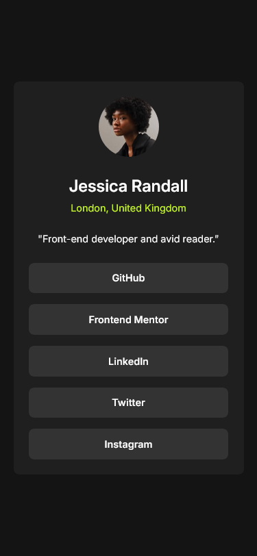

# Frontend Mentor - Social links profile solution

This is a solution to the [Social links profile challenge on Frontend Mentor](https://www.frontendmentor.io/challenges/social-links-profile-UG32l9m6dQ). Frontend Mentor challenges help you improve your coding skills by building realistic projects. 

## Table of contents

- [Overview](#overview)
  - [The challenge](#the-challenge)
  - [Screenshot](#screenshot)
  - [Links](#links)
- [My process](#my-process)
  - [Built with](#built-with)
- [Author](#author)
- [Acknowledgments](#acknowledgments)

**Note: Delete this note and update the table of contents based on what sections you keep.**

## Overview

### The challenge

Users should be able to:

- See hover and focus states for all interactive elements on the page

### Screenshot

#### Mobile

#### Desktop

### Links

- Solution URL: [Social Links Profile Main (Github)](https://github.com/ashkir004/social-links-profile-main)
- Live Site URL: [Social Links Profile Main (Netlify)](https://ashkir004-social-links-profile-main.netlify.app/)

## My process

### Built with

- Semantic HTML5 markup
- Flexbox
- Mobile-first workflow

## Author
- Github - [@ashkir004](https://www.github.com/ashkir004)
- Frontend Mentor - [@ashkir004](https://www.frontendmentor.io/profile/ashkir004)

## Acknowledgments

- [Frontendmentor.io](https://www.frontendmentor.io/)
